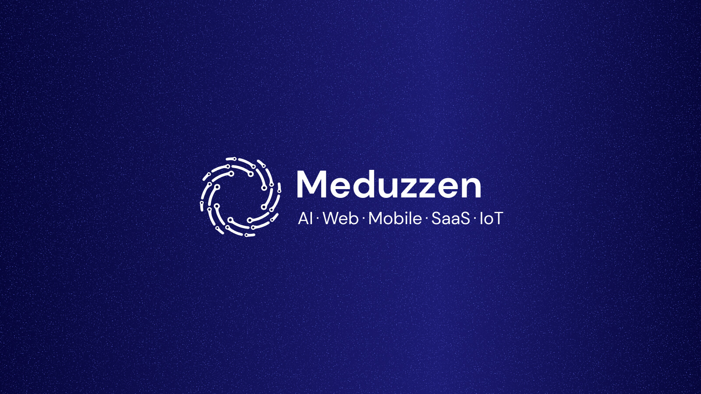

# Meduzzen

We build software end to end: AI, web, mobile, and SaaS. From the first prototype to systems that hold under real load.

A senior engineering team you hire, with 370+ client reviews and a 100% Job Success Score on Upwork.

## What we have built

- AI voice agents and assistants running in production
- RAG and vector-search systems for legal, compliance, and education
- Platforms scaled to hundreds of thousands of concurrent users
- Data systems across tens of millions of records
- Healthcare and back-office automation that removes manual workload
- SaaS products, marketplaces, and public-sector portals in daily use

## Work with us

Hire pre-vetted senior engineers through [Talent Lab](https://meduzzen.com/talent-lab/?utm_source=github&utm_medium=org_readme):

[AI/ML](https://meduzzen.com/hire/ai-developers/?utm_source=github&utm_medium=org_readme) · [Python](https://meduzzen.com/hire/python-developers/?utm_source=github&utm_medium=org_readme) · [FastAPI](https://meduzzen.com/hire/fastapi-developers/?utm_source=github&utm_medium=org_readme) · [Django](https://meduzzen.com/hire/django-developers/?utm_source=github&utm_medium=org_readme) · [Node.js](https://meduzzen.com/hire/node-js-developers/?utm_source=github&utm_medium=org_readme) · [React](https://meduzzen.com/hire/react-developers/?utm_source=github&utm_medium=org_readme) · [Backend](https://meduzzen.com/hire/backend-developers/?utm_source=github&utm_medium=org_readme) · [Full-stack](https://meduzzen.com/hire/full-stack-developers/?utm_source=github&utm_medium=org_readme)

[Blog](https://meduzzen.com/blog/?utm_source=github&utm_medium=org_readme) · [Careers](https://meduzzen.com/careers/?utm_source=github&utm_medium=org_readme) · [Upwork](https://www.upwork.com/agencies/meduzzen/) · [Clutch](https://clutch.co/profile/meduzzen)

*Built in Ukraine. Working with clients worldwide.*
